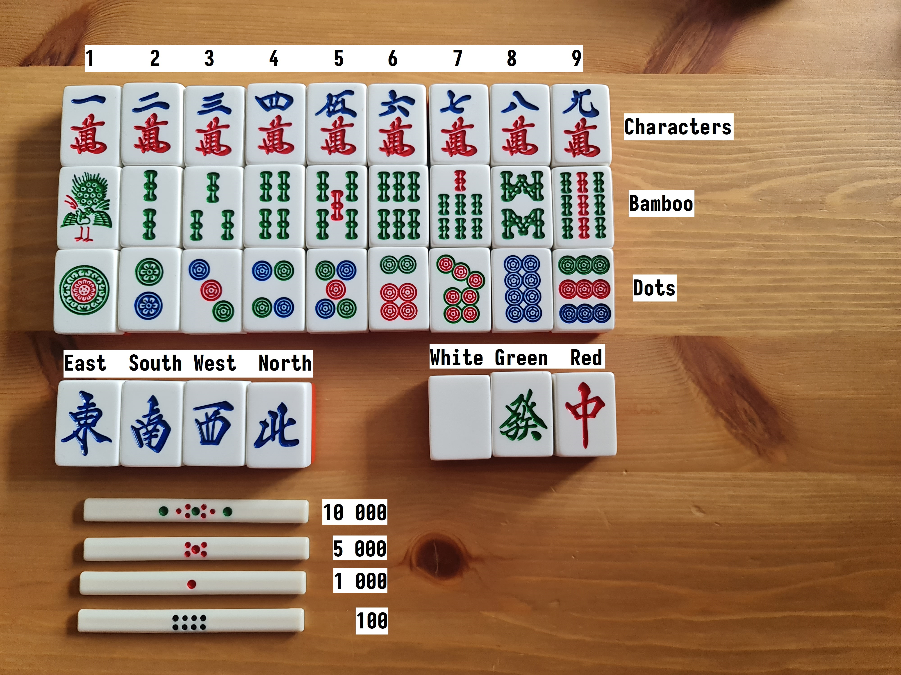

# Tiles cheat sheet

# Rules

Riichi Competition Rules used in EMA[^1] tournaments: http://mahjong-europe.org/portal/index.php?option=com_content&view=article&id=30&Itemid=166

# Games

## Kemono Mahjong (< 4€)

Website: http://cyberdog.ca/kemono-mahjong/

A mobile/Steam game that lets you play against computer with no time limits. It defaults to the EMA rules and provides several tutorials explaining the rules.

(Note that the layout on phone-sized screens is a bit unusual due to space constraints.)

## Tenhou (free)

Website: https://tenhou.net/

"Documentation" (in English): https://arcturus.su/tenhou/

A popular server where you can play for free with players around the world, even without creating an account. The default time limit is 5s per turn + 10s per hand. The website is in Japanese, but the apps and the online client have interfaces in English and several other languages.

# Websites about mahjong

## USPML[^2] streams

YouTube: https://www.youtube.com/@uspml

Twitch: https://www.twitch.tv/uspml

Two experienced English-speaking players discussing mahjong and mahjong-related news.

## Riichi.Wiki

Website: https://riichi.wiki/

## Osamuko blog

Website: https://osamuko.com/

[^1]: European Mahjong Association (http://mahjong-europe.org/portal/)
[^2]: United States Professional Mahjong League (https://uspml.com/)
